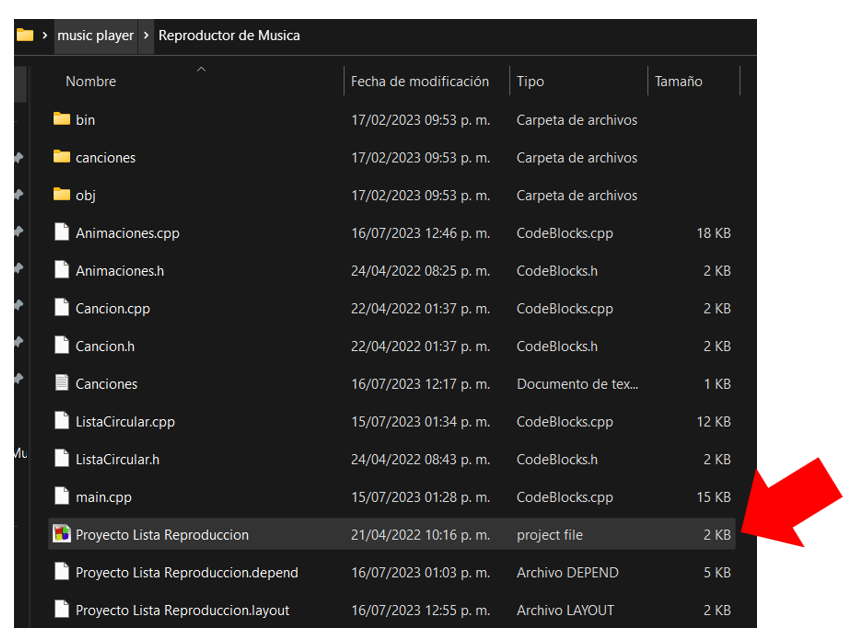
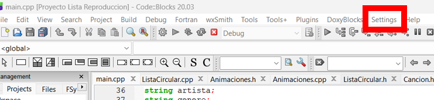
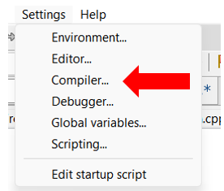
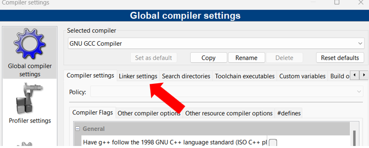
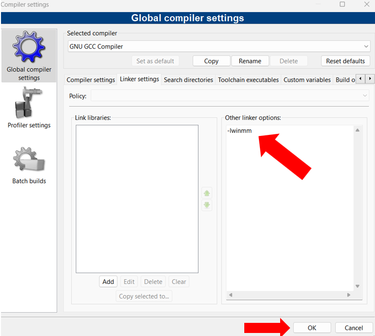
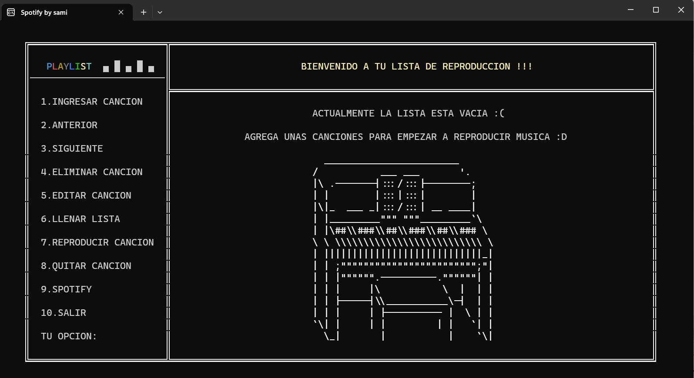
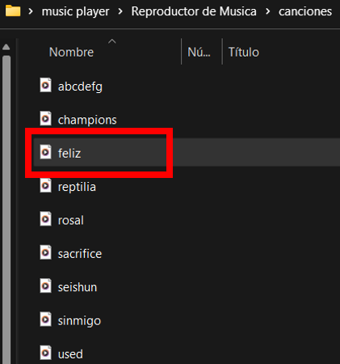
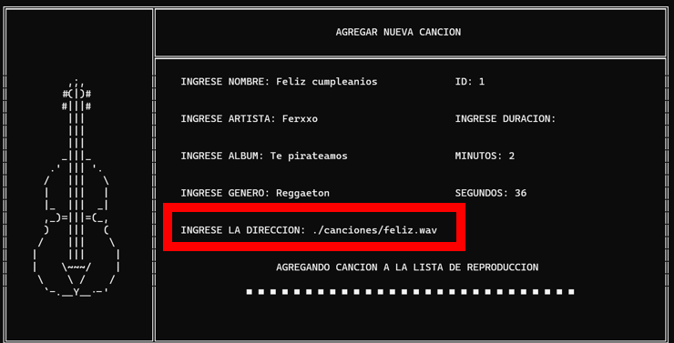
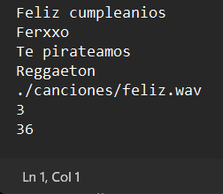

# MusicPlayer 🎧

https://github.com/sami-sopas/MusicPlayer/assets/99571985/6689f0f2-a96e-43d5-8160-f3cd992a090f

Este codigo fue escrito en español en su momento, asi que la guia para utilizarlo tambien lo sera.  
  
Desconozco si utilizando otro IDE, otro compilador u otro sistema operativo funcionara de la misma manera, en mi caso lo probe con Windows 10 y 11 y funciono correctamente. 

Asi que explicare como compilar este programa utilizando [CodeBlocks 20.03](https://sourceforge.net/projects/codeblocks/files/Binaries/20.03/Windows/codeblocks-20.03mingw-setup.exe/download)

# ¿Cómo funciona? 🔍

La base de este programa es una **lista dinámica circular doblemente enlazada** con la que se maneja la informacion a traves de objetos, esta informacion se guarda en un archivo de texto para ser capaces de recuperarla cuando se necesite.

Con ayuda de la libreria **Windows.h** fue posible darle una "interfaz" amigable a este programa de consola.  

Asi mismo, la libreria **Winmm** nos permitio reproducir las canciones que podremos encontrar en la carpeta `/Reproductor de Musica/canciones`  

# Configuracion 🎺

1. Descargar este repositorio
2. Dirigirse a la carpeta `/Reproductor de Musica/`
3. Abrir el archivo de proyecto **Proyecto Lista de reproduccion.cbp**

    

4. Se abrira CodeBlocks y nos dirigiremos a la pestaña de **settings**

    

5. Seleccionaremos la opcion de **compiler**  

    

6. Damos click a la pestaña **Linker settings**

    

7. En el apartado de **Other linker options** escribiremos `-lwinmm`  
   
    

8. Damos click al boton que dice **Ok** y con esto podremos reproducir canciones, las demas librerias ya vienen importadas en el mismo archivo *main*

# Guia de uso 🎹

En esta seccion explicare con más detalle las diferentes opciones que tiene el programa.

## Compilando ⚙️

En la parte superior tendremos un boton con el siguiente icono **►** el cual dira **run**, aqui es donde compilaremos el programa.    

Si nuestro CodeBlocks quedo bien configurado, esta sera la pantalla que veremos:

  

## LLenando la lista ✅  

Con el teclado, escribiremos **6** para usar la opcion que dice **LLenar lista.**.   
* El programa viene por defecto con 2 canciones que se encuentran en la carpeta `/Reproductor de musica/canciones`

* Los datos de cada cancion vienen en el archivo de texto `/Reproductor de musica/Canciones.txt`  

Despues de haber utilizado esta opcion, podremos visualizar las canciones ya cargadas en el programa.

  

## Reproducir canción ▶️

Con las opciones **2 y 3** nos podremos desplazar por el menu para ir cambiando de cancion.  
 En la parte superior se muestran los datos de las canciones y la flecha **<-** nos indica en cual estamos posicionados.  

Con la opcion **7** se reproducira la cancion en la que estemos posicionados y con la opcion **8** la quitaremos (no hay forma de pausarla)

Por ultimo, la opcion **9** nos permitira realizar lo mismo pero en otra interfaz más bonita como la siguiente:

  

**PD:** Si escribimos **1 o 3** podremos avanzar o retroceder de canción :D

## Agregar canción 🎀

Para agregar una canción al programa tendremos que seguir los siguientes pasos:  

1. Descargar la cancion que queramos en formato **.WAV**, despues la moveremos dentro de la carpeta `Reproductor de musica/canciones` (De preferencia asignarle un nombre corto)
 
    Con estas paginas web descargue las canciones en MP3 y despues la converti a WAV

    * [YouTube a MP3](https://es.ytmp3.mobi/es34/)    
    * [Convertidor MP3 a WAV](https://audio.online-convert.com/es/convertir-a-wav)

     

      

2. En el menu del programa, seleccionaremos la opcion **1**, se nos abrira un apartado en donde nos perdira los datos de la canción (nombre,genero,duracion etc).  
   
    Pero en la parte en donde dice **INGRESE LA DIRECCION**, ahi escribiremos la ruta relativa en donde se encuentra la cancion:

    `./canciones/nombre.wav `  

     

3. Nos regresara al menu principal, en donde veremos la cancion agregada, ademas si revisamos el archivo `Canciones.txt`, vemos que se guardo correctamente.  

     

     

     

# IMPORTANTE ⚠️

* Las funciones de **editar y eliminar** funcionan mientras el programa se esta ejecutando, sin embargo, estos cambios no se veran reflejados en el archivo de texto.
* El programa solo admite archivos de audio tipo WAV, cualquier otro formato no se podra reproducir, y en caso de que no lea bien la ruta relativa de acceso, puedes optar por cambiarla por una ruta absoluta.
* Agregar más de 10 canciones o escribir titulos demasiado largos puede afectar la interfaz del programa.
* Evita escribir letras donde se esperan numeros, ya que las entradas no estan validadas.
* Verifica que no haya saltos de linea o dejar espacios en blanco para evitar problemas al momento de leer la información.

